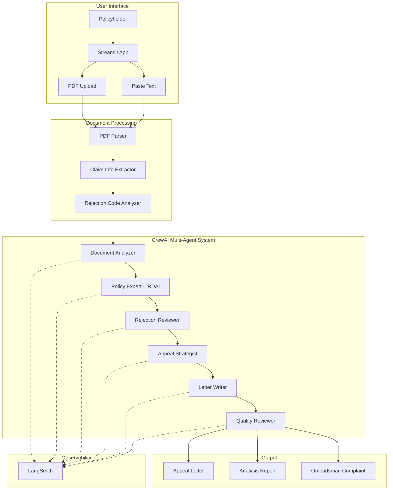
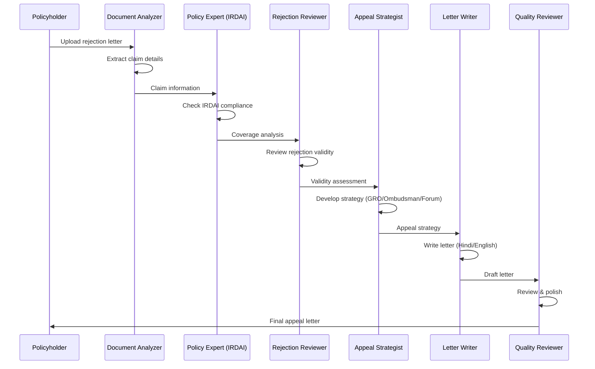

# Insurance Claim Assistant (India)

An AI-powered multi-agent system that analyzes health insurance claim rejections and generates professional appeal letters for Indian insurance companies, using CrewAI, Mistral AI, and Streamlit.

## Built for Indian Insurance System

- **IRDAI Regulations**: Compliant with IRDAI (Insurance Regulatory and Development Authority of India) guidelines
- **Indian Insurance Companies**: Star Health, ICICI Lombard, HDFC ERGO, Bajaj Allianz, and more
- **Multi-Level Appeals**: GRO, IGMS Portal, Insurance Ombudsman, Consumer Forum
- **Hindi + English**: Support for bilingual appeal letters

---

## Key Features

### AI-Powered Smart Extraction
When you upload a PDF or paste text, the app uses **Mistral AI** to intelligently extract:
- Claim Number, Policy Number
- Patient Name (without titles)
- Insurance Company Name
- Hospital Name (clean, without address)
- TPA Name
- Admission & Discharge Dates
- Claim Amount
- Denial Reason & Codes

Auto-filled fields are marked with a checkmark in the form!

### Document Analysis
- Upload rejection letters (PDF) or paste text
- AI extracts structured information automatically
- Shows what was extracted with a success message

### 90+ Rejection Codes Database
Comprehensive database of Indian insurance rejection codes including:
- **PED** - Pre-existing disease
- **WP** - Waiting period
- **EXC** - Policy exclusions
- **PA** - Pre-authorization issues
- **MN** - Medical necessity
- **MATERNITY** - Maternity claims
- **CANCER** - Cancer treatment
- **CARDIAC** - Heart procedures
- **COVID** - COVID-19 claims
- And 20+ more categories!

### 6-Agent Collaboration
Multi-agent CrewAI system for thorough analysis:
1. **Document Analyzer** - Extracts claim details
2. **Policy Expert** - IRDAI compliance check
3. **Denial Reviewer** - Validates rejection
4. **Appeal Strategist** - Builds legal strategy
5. **Letter Writer** - Drafts appeal
6. **Quality Reviewer** - Final polish

### Export Options
- **Download PDF** - Professional PDF appeal letter (letter content only)
- **Download Word** - Editable .docx format (letter content only)
- **Send via Email** - Opens your email app with pre-filled content
- **Go to Home** - Return to start
- **New Analysis** - Analyze another claim

### Clean Letter Separation
The AI generates both the appeal letter and guidance/next steps. These are now separated:
- **Letter area**: Contains only the actual appeal letter (for downloads)
- **AI Guidance section**: Shows next steps, final notes, and recommendations in a separate expandable panel

---

## Architecture

### High-Level Overview



### Agent Pipeline



### 6 AI Agents

| Agent | Role | Expertise |
|-------|------|-----------|
| Document Analyzer | Extract claim info | Indian insurance documents, TPAs |
| Policy Expert | Analyze coverage | IRDAI regulations, policy terms |
| Rejection Reviewer | Validate rejection | Rejection codes, IRDAI violations |
| Appeal Strategist | Plan appeal | GRO, IGMS, Ombudsman, Consumer Forum |
| Letter Writer | Draft appeal | Hindi/English formal letters |
| Quality Reviewer | Final check | Accuracy, completeness, tone |

---

## Indian Insurance Rejection Codes

The system understands these common rejection categories:

| Code | Category | Description |
|------|----------|-------------|
| PED-001 | Pre-Existing Disease | Within 48-month waiting period |
| PED-002 | Non-Disclosure | Material fact not disclosed |
| WP-001 | Initial Waiting | 30-day waiting period |
| WP-002 | Specific Disease | 24-month waiting (joint replacement, cataract) |
| PA-001 | Pre-Authorization | No prior authorization |
| MN-001 | Medical Necessity | Treatment not medically necessary |
| SL-001 | Sub-Limits | Room rent/procedure sub-limits |
| DOC-001 | Documentation | Incomplete documents |

---

## Quick Start

### Prerequisites

- Python 3.11+
- [UV package manager](https://docs.astral.sh/uv/getting-started/installation/) - Install with: `curl -LsSf https://astral.sh/uv/install.sh | sh`
- Mistral AI API key (get from [console.mistral.ai](https://console.mistral.ai))

### Installation

```bash
# Clone repository
git clone git@github.com:vishwaskv362/AgenticInsuranceClaimAssitant.git
cd AgenticInsuranceClaimAssitant

# Install dependencies with UV (creates .venv automatically)
uv sync

# Configure environment
cp .env.example .env
# Edit .env with your API keys
```

### Environment Variables

```env
# Required
MISTRAL_API_KEY=your_mistral_api_key

# Optional (LangSmith for tracing)
LANGCHAIN_TRACING_V2=true
LANGCHAIN_API_KEY=your_langsmith_api_key
LANGCHAIN_PROJECT=insurance-claim-assistant

# Disable telemetry
CREWAI_TELEMETRY_OPT_OUT=true
OTEL_SDK_DISABLED=true
```

### Run the Application

```bash
# Always use uv run (NOT pip or python directly)
uv run streamlit run app.py
```

Open http://localhost:8501 in your browser.

---

## Usage

### Step 1: Upload Rejection Letter
- Upload PDF of claim rejection letter, OR
- Paste the rejection letter text directly

### Step 2: Review Extracted Information
- Verify claim number, policy number, rejection reason
- Add patient details if needed
- Optionally add policy document for cross-reference

### Step 3: AI Analysis
- Click "Analyze & Generate Appeal"
- Wait for 6 agents to analyze (1-2 minutes)
- Review generated appeal letter

### Step 4: Submit Appeal
Use the generated letter to:
1. **GRO (Grievance Redressal Officer)** - First level
2. **IGMS Portal** - igms.irda.gov.in
3. **Insurance Ombudsman** - For claims up to ₹50 lakhs
4. **Consumer Forum** - District/State/National

---

## Sample Documents

The `samples/` folder contains test documents:

| File | Description |
|------|-------------|
| `sample_rejection_1_star_health.txt` | Star Health - Waiting period rejection |
| `sample_rejection_2_icici_lombard.txt` | ICICI Lombard - Pre-auth rejection |
| `sample_rejection_3_hdfc_partial.txt` | HDFC ERGO - Partial payment (room rent) |
| `sample_policy_bajaj_allianz.txt` | Bajaj Allianz policy document |

---

## Project Structure

```
insurance-claim-assistant/
├── app.py                  # Streamlit web UI
├── crew.py                 # CrewAI agents and tasks
├── config.py               # Configuration settings
├── pyproject.toml          # Dependencies
├── .env                    # API keys (not in git)
├── knowledge/
│   ├── denial_codes.json   # Indian rejection codes
│   ├── regulations.md      # IRDAI regulations
│   └── appeal_templates.md # Letter templates
├── tools/
│   ├── pdf_parser.py       # PDF text extraction
│   └── denial_codes.py     # Code lookup
├── samples/
│   ├── sample_rejection_*.txt
│   └── sample_policy_*.txt
└── output/                 # Generated letters
```

---

## Key IRDAI References

| Regulation | Description |
|------------|-------------|
| Insurance Act, 1938 | Section 45 - 3-year contestability |
| IRDAI Health Regulations 2016 | Claim settlement timelines |
| IRDAI Circular 256/11/2020 | 8-year moratorium period |
| Consumer Protection Act 2019 | Consumer forum rights |
| Insurance Ombudsman Rules 2017 | Free dispute resolution |

---

## Appeal Timelines

| Level | Timeline | Cost |
|-------|----------|------|
| GRO (Company) | 15 days response | Free |
| IGMS (IRDAI) | 15 days | Free |
| Insurance Ombudsman | 3 months decision | Free |
| Consumer Forum | 3-6 months | Filing fee |

---

## Helpful Contacts

| Organization | Contact |
|--------------|---------|
| IRDAI Helpline | 155255 |
| IGMS Portal | igms.irda.gov.in |
| Consumer Helpline | 1800-11-4000 |
| Insurance Ombudsman | www.cioins.co.in |

---

## Tech Stack

| Component | Technology | Purpose |
|-----------|------------|---------|
| **Multi-Agent Framework** | CrewAI 1.9.x | Orchestrates 6 specialized AI agents |
| **LLM Provider** | Mistral AI | Powers all agent reasoning (mistral-small-latest) |
| **LLM Router** | LiteLLM | Routes CrewAI requests to Mistral API |
| **Web UI** | Streamlit | User-friendly interface |
| **PDF Processing** | pdfplumber, pypdf | Extract text from rejection letters |
| **Observability** | LangSmith | Debugging and tracing (optional) |
| **Package Manager** | UV | Fast Python dependency management |

---

## How It Works (Technical Deep Dive)

### AI-Powered Smart Extraction

When you upload a document, the app uses Mistral AI to intelligently extract structured data:

```python
from langchain_mistralai import ChatMistralAI

# The extraction prompt asks for clean, structured JSON
system_prompt = """Extract the following fields from the insurance document.
Return ONLY valid JSON with these keys:
- claim_number
- policy_number  
- patient_name (without Mr/Mrs titles)
- insurer_name (just company name)
- hospital_name (without address)
- admission_date, discharge_date
- claim_amount
- denial_reason
- denial_codes (array)
"""

llm = ChatMistralAI(model="mistral-small-latest", temperature=0.1)
response = llm.invoke([SystemMessage(system_prompt), HumanMessage(document_text)])
extracted_data = json.loads(response.content)
```

This is much more accurate than regex patterns because:
- AI understands context and document structure
- Extracts clean values without surrounding text
- Handles various document formats
- Falls back to regex if AI fails

### CrewAI Multi-Agent Architecture

CrewAI is a framework for building multi-agent systems where specialized AI agents collaborate to complete complex tasks.

```python
from crewai import Agent, Task, Crew, Process, LLM

# Each agent has a role, goal, and backstory
agent = Agent(
    role="Insurance Document Analyst",
    goal="Extract relevant information from claim documents",
    backstory="Expert in Indian insurance with 15 years experience...",
    llm=llm,  # Mistral AI
)

# Tasks define what agents should do
task = Task(
    description="Analyze the rejection letter...",
    expected_output="Structured claim information",
    agent=agent,
)

# Crew orchestrates agents working together
crew = Crew(
    agents=[agent1, agent2, ...],
    tasks=[task1, task2, ...],
    process=Process.sequential,  # Agents work one after another
)

# Execute the workflow
result = crew.kickoff()
```

### LLM Configuration (Mistral via LiteLLM)

CrewAI uses LiteLLM to support non-OpenAI models. The `mistral/` prefix routes requests to Mistral's API:

```python
from crewai import LLM

llm = LLM(
    model="mistral/mistral-small-latest",  # LiteLLM routing prefix
    api_key=os.environ["MISTRAL_API_KEY"],
    temperature=0.3,  # Lower = more focused, deterministic
)
```

### Agent Workflow

```
User Input (Rejection Letter)
         │
         ▼
┌─────────────────────────────────────────────────────────────────┐
│  🤖 AI Smart Extraction (Mistral)                               │
│  - Extracts: Claim #, Policy #, Patient, Hospital, Amount       │
│  - Returns: Clean, structured JSON                              │
│  - Auto-fills form fields with ✓ markers                        │
└─────────────────────────────────────────────────────────────────┘
         │
         ▼
┌─────────────────────────────────────────────────────────────────┐
│  Agent 1: Document Analyzer                                     │
│  - Deep analysis of claim details                               │
│  - Identifies: Rejection codes, TPA name, Insurer               │
└─────────────────────────────────────────────────────────────────┘
         │
         ▼
┌─────────────────────────────────────────────────────────────────┐
│  Agent 2: Policy Expert                                         │
│  - Reviews policy terms and conditions                          │
│  - Checks exclusions, waiting periods, sub-limits               │
│  - Verifies if claim should be covered                          │
└─────────────────────────────────────────────────────────────────┘
         │
         ▼
┌─────────────────────────────────────────────────────────────────┐
│  Agent 3: Denial Reviewer                                       │
│  - Analyzes rejection validity against IRDAI regulations        │
│  - Identifies procedural errors by insurer                      │
│  - Checks if denial code was correctly applied                  │
└─────────────────────────────────────────────────────────────────┘
         │
         ▼
┌─────────────────────────────────────────────────────────────────┐
│  Agent 4: Appeal Strategist                                     │
│  - Develops legal arguments based on regulations                │
│  - References IRDAI circulars, Insurance Act, case law          │
│  - Recommends escalation path (GRO → Ombudsman → Forum)         │
└─────────────────────────────────────────────────────────────────┘
         │
         ▼
┌─────────────────────────────────────────────────────────────────┐
│  Agent 5: Letter Writer                                         │
│  - Drafts professional appeal letter                            │
│  - Includes all legal arguments and evidence references         │
│  - Supports Hindi/English format                                │
└─────────────────────────────────────────────────────────────────┘
         │
         ▼
┌─────────────────────────────────────────────────────────────────┐
│  Agent 6: Quality Reviewer                                      │
│  - Reviews for accuracy and completeness                        │
│  - Ensures proper tone and formatting                           │
│  - Provides final polished output                               │
└─────────────────────────────────────────────────────────────────┘
         │
         ▼
   Final Appeal Letter + Analysis Report
```

### Knowledge Base

The agents access a curated knowledge base:

| File | Contents |
|------|----------|
| `knowledge/denial_codes.json` | 60+ Indian rejection codes with appeal strategies |
| `knowledge/regulations.md` | IRDAI regulations, Insurance Act, Consumer Protection Act |
| `knowledge/appeal_templates.md` | Templates for GRO, Ombudsman, Consumer Forum appeals |

### Denial Codes Database (60+ codes)

```json
{
  "PED-001": {
    "description": "Pre-existing disease - not covered during waiting period",
    "category": "Pre-Existing Disease",
    "common_insurers": ["Star Health", "ICICI Lombard"],
    "appeal_strategies": [
      "Challenge disease classification",
      "Request 8-year moratorium rule application"
    ],
    "required_documents": ["Medical records", "Doctor certificate"],
    "success_likelihood": "medium"
  }
}
```

Categories covered:
- **PED**: Pre-existing disease (10 codes)
- **WP**: Waiting period (5 codes)
- **EXC**: Policy exclusions (8 codes)
- **DOC**: Documentation issues (5 codes)
- **MN**: Medical necessity (5 codes)
- **PA**: Pre-authorization (5 codes)
- **NW**: Network hospital (5 codes)
- **SL**: Sub-limits (5 codes)
- **AMT**: Amount disputes (5 codes)
- And more: FRD, POL, COB, MH, AYUSH, DAY, OPD, AGE, TPA, NCB

---

## Troubleshooting

### Error: "OPENAI_API_KEY is required"

**Cause**: CrewAI has OpenAI as a dependency and checks for the key during initialization.

**Solution**: We set a dummy key that's never used, since all LLM calls go through Mistral:
```python
os.environ["OPENAI_API_KEY"] = "sk-dummy-key-not-used"
```

### Error: "Fallback to LiteLLM is not available"

**Cause**: LiteLLM package not installed.

**Solution**: 
```bash
uv add litellm
```

### Signal Handler Warnings

**Cause**: CrewAI telemetry tries to set signal handlers.

**Solution**: Add to `.env`:
```env
CREWAI_TELEMETRY_OPT_OUT=true
OTEL_SDK_DISABLED=true
```

### Error: "Error code: 401 - Incorrect API key"

**Cause**: CrewAI was using the dummy OpenAI key for internal operations.

**Solution**: Use CrewAI's native `LLM` class with LiteLLM routing:
```python
from crewai import LLM

llm = LLM(
    model="mistral/mistral-small-latest",  # mistral/ prefix = LiteLLM
    api_key=config.MISTRAL_API_KEY,
)
```

### Slow Response (1-2 minutes)

**Cause**: 6 agents processing sequentially, each making multiple LLM calls.

**Solution**: This is expected behavior. Each agent needs to:
1. Read the context
2. Reason about the task
3. Generate output
4. Pass to next agent

---

## Contributing

1. Fork the repository
2. Create feature branch (`git checkout -b feature/AmazingFeature`)
3. Commit changes (`git commit -m 'Add AmazingFeature'`)
4. Push to branch (`git push origin feature/AmazingFeature`)
5. Open Pull Request

---

## License

MIT License - see LICENSE file

---

## Disclaimer

This tool is for educational and informational purposes only. It does not constitute legal or professional advice. Always consult with a qualified professional for specific insurance disputes.

---

## Support

If you find this helpful, please ⭐ the repository!

For issues and feature requests, please open a GitHub issue.

---

**Built with ❤️ for Indian Policyholders**

*आपका बीमा, आपका अधिकार | Your Insurance, Your Right*
